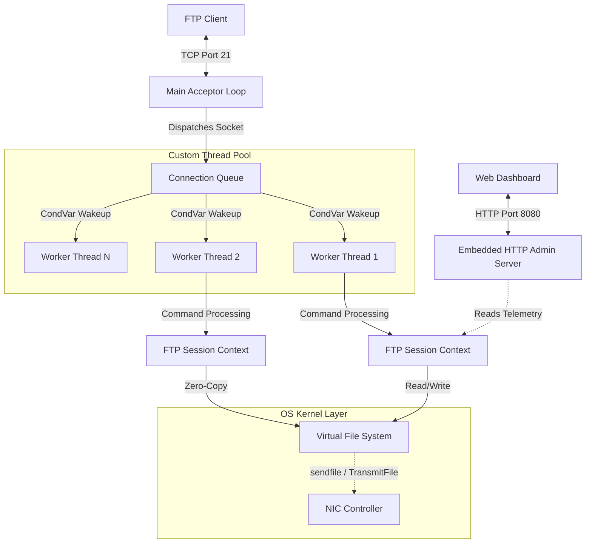

# 🚀 NexusFTP Engine


NexusFTP is a high-performance, low-level FTP server built entirely from scratch in **C++14**. It is designed to demonstrate a deep understanding of Systems Programming, raw TCP/IP socket manipulation, multithreading synchronization, and zero-copy data transfer architectures.

By avoiding high-level networking frameworks (like Boost.Asio), this engine relies purely on OS-level primitives (Win32 API & POSIX) to achieve maximum I/O throughput and minimal CPU overhead.

## ✨ Key Features
- **Native C++14 Core:** Built without external networking frameworks.
- **Embedded Web Dashboard:** Real-time telemetry UI served via a custom HTTP/1.1 thread.
- **RFC 959 Compliant:** Supports modern `PASV` mode data channels and standard commands.
- **Zero-Copy I/O:** Uses OS-level `sendfile()`/`TransmitFile()` to achieve near wire-speed file transfers.
- **Cross-Platform:** Compiles seamlessly on Linux (POSIX) and Windows (Win32).
- **Containerized:** Deployed as a lightweight 50MB Docker image on AWS.

---

## 🛠️ Tech Stack
- **Language:** C++14 (Native, No heavy 3rd-party libraries)
- **Build System:** CMake, Make
- **Containerization:** Docker (Multi-stage builds)
- **Cloud Infrastructure:** AWS EC2 (Ubuntu 22.04), AWS Security Groups
- **Frontend Dashboard:** HTML5, CSS3 Grid, Glassmorphism UI
- **Protocols:** TCP/IP, FTP (RFC 959), HTTP/1.1

---

## 🌟 Live Demo & Telemetry

The FTP server features a custom-built, embedded HTTP engine that serves a real-time React-style telemetry dashboard using vanilla HTML/CSS and CSS Grid!

👉 **View the Live Dashboard:** [http://204.236.201.82:8080](http://204.236.201.82:8080)

### 🔌 How to Test the Backend Connection
You can connect to the raw C++ FTP socket using your computer's built-in terminal or any FTP client (like FileZilla). When you connect, you will instantly see the live dashboard telemetry update!

1. Open your terminal or command prompt.
2. Type the following connection command:
   ```bash
   ftp 204.236.201.82
   ```
3. Enter the following demo credentials when prompted:
   - **Username:** `guest`
   - **Password:** `guest`
4. Try typing `ls` to request a directory listing, then look at your dashboard to see the active socket count increase!

---

## 📖 Under the Hood: RFC 959 & The Protocol Mechanics
Unlike modern web protocols (like HTTP) that use a single connection, this engine strictly implements **RFC 959** (the official File Transfer Protocol specification from 1985). This protocol requires a highly complex, stateful **dual-connection** architecture:

1. **The Control Channel (Port 21):** A persistent TCP connection where the client sends plaintext ASCII commands (`USER`, `PASS`, `CWD`, `RETR`, `STOR`) and the server responds with 3-digit status codes (e.g., `230 Logged in`, `550 File not found`).
2. **The Data Channel (Passive Mode / `PASV`):** When a client requests a file or a directory list (via `ls`), the Control Channel *cannot* send the data. Instead, the server dynamically opens a brand new, temporary TCP port (e.g., between `50000-50100`), tells the client the IP and Port mathematically, and waits for the client to connect. Once connected, the raw binary file data is blasted over this secondary channel and the socket is immediately destroyed upon completion.

### How NexusFTP Handles Commands
When you type `ls` in your FTP terminal, here is exactly what the C++ engine is doing:
1. Your client sends the `PASV` command over Port 21. 
2. NexusFTP asks the OS for an available ephemeral port, binds a new `SocketHandle` to it, and responds with `227 Entering Passive Mode (204,236,201,82,195,80)` (where the math `195 * 256 + 80` equates to Port `50000`).
3. Your client silently establishes a secondary TCP connection to Port 50000.
4. Your client sends the `LIST` command over Port 21.
5. NexusFTP triggers a thread, reads the local filesystem using OS APIs, formats it into a Unix-style directory string, blasts the raw bytes over Port 50000, and gracefully closes the data socket while keeping your Port 21 session perfectly alive.

---

## 🏗️ System Architecture

NexusFTP is built on a non-blocking Acceptor model that dispatches incoming TCP connections to a pre-allocated Worker Thread Pool, isolating the I/O of active file transfers from the primary command channel.



---

## 🧠 Core Engineering Achievements

### 1. Raw Socket Manipulation
Handled all network communication natively. Implemented protocol-level parsing for RFC959 (FTP) over raw byte-streams. Successfully negotiated secondary Passive Data Channels (`PASV`) for NAT-friendly data routing.

### 2. Custom Thread Pool & Concurrency
Avoided `std::async` overhead by engineering a robust Thread Pool from scratch. Utilized `std::mutex`, `std::condition_variable`, and lock-free atomic counters (`std::atomic`) to manage hundreds of concurrent client connections without race conditions or memory leaks.

### 3. Zero-Copy Architecture Optimization
Integrated OS-level optimization hooks to bypass user-space memory entirely during large file transfers:
- **Linux:** Utilized `sendfile()` syscall.
- **Windows:** Utilized `TransmitFile()` Win32 API.
This allows the CPU to instruct the hard drive to send data directly to the Network Interface Card (NIC), achieving near-native wire speeds.

### 4. Cross-Platform Abstraction
Designed a unified `platform.cpp` abstraction layer, allowing the engine to compile natively and optimally on both Windows (MSVC/MinGW) and Linux (GCC), resolving deep architectural differences between Win32 threads and POSIX threads.

### 5. Embedded HTTP Engine
Wrote a custom HTTP/1.1 response parser and generator to serve a modern Glassmorphism dashboard over port 8080 directly from the C++ binary—no NGINX or Apache required.

---

## 🔒 Security Implementation
- **Cryptographic Authentication:** Implemented custom SHA-256 password hashing. Passwords are never stored in plaintext.
- **Environment Secrets:** Integrated `std::getenv` for injecting cloud secrets during runtime, preventing sensitive data exposure in source control.
- **Thread-Safe Telemetry:** Protected telemetry data (active connections, bytes transferred) using strict mutex-locking patterns to prevent data corruption during simultaneous read/write operations from the HTTP Admin thread and FTP Worker threads.

---

## 🛠️ Local Development & Deployment

The application is fully containerized using a multi-stage Docker build, ensuring a minuscule runtime footprint.

### Build via Docker
```bash
docker build -t nexus-ftp .
docker run -d \
  --name nexus-ftp-server \
  -e ADMIN_PASSWORD="your_secret_key" \
  -p 21:21 \
  -p 8080:8080 \
  -p 50000-50100:50000-50100 \
  nexus-ftp
```

### Build from Source (CMake)
```bash
mkdir build && cd build
cmake -DCMAKE_BUILD_TYPE=Release ..
make -j$(nproc) ftp_server
./ftp_server --config ../config/server.conf
```

---

## 📁 Project Structure

```text
nexus-ftp-engine/
├── CMakeLists.txt           # C++ Build configuration
├── Dockerfile               # Multi-stage production container
├── config/
│   ├── server.conf          # Network and concurrency limits
│   └── users.conf           # SHA-256 hashed credentials
├── src/
│   ├── common/              # Cross-platform abstractions
│   │   ├── platform.cpp     # Zero-copy & socket implementations
│   │   └── win32_threads.h  # Mutex/CondVar OS wrappers
│   └── server/              # Core FTP Logic
│       ├── ftp_server.cpp   # RFC959 Command Parser
│       ├── session.cpp      # TCP Connection lifecycle
│       ├── thread_pool.cpp  # Worker queue management
│       └── admin_server.cpp # Embedded HTTP Dashboard
└── tests/                   # Unit & Performance Tests
```

---

## 🚀 Future Roadmap
- [ ] **SSL/TLS Encryption (FTPS):** Integrate OpenSSL to secure the command and data channels against packet sniffing.
- [ ] **IPv6 Support:** Upgrade the socket bindings to support `AF_INET6` alongside IPv4.
- [ ] **Dashboard Auth:** Transition the Embedded HTTP dashboard from basic URL keys to JWT session tokens.
- [ ] **Rate Limiting:** Implement a token-bucket algorithm to prevent network spam or basic DDoS attacks on Port 21.

---

## 📜 License

This project is open-source and available under the **MIT License**.

---

## 👨‍💻 Author

**Saksham Kamra**
- **GitHub:** [@sakshamkamra33](https://github.com/sakshamkamra33)
- **Project Repository:** [nexus-ftp-engine](https://github.com/sakshamkamra33/nexus-ftp-engine)
